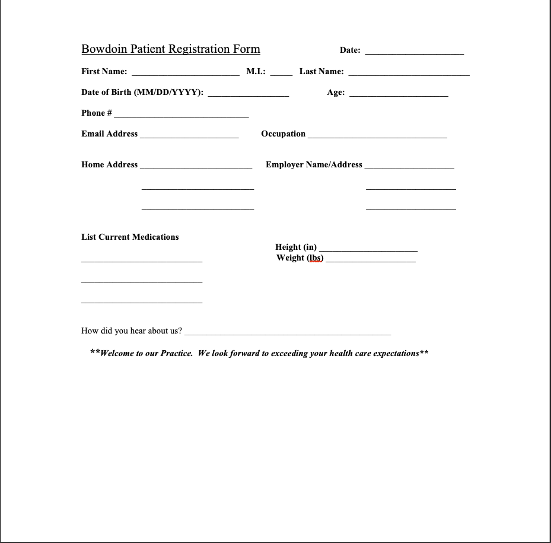
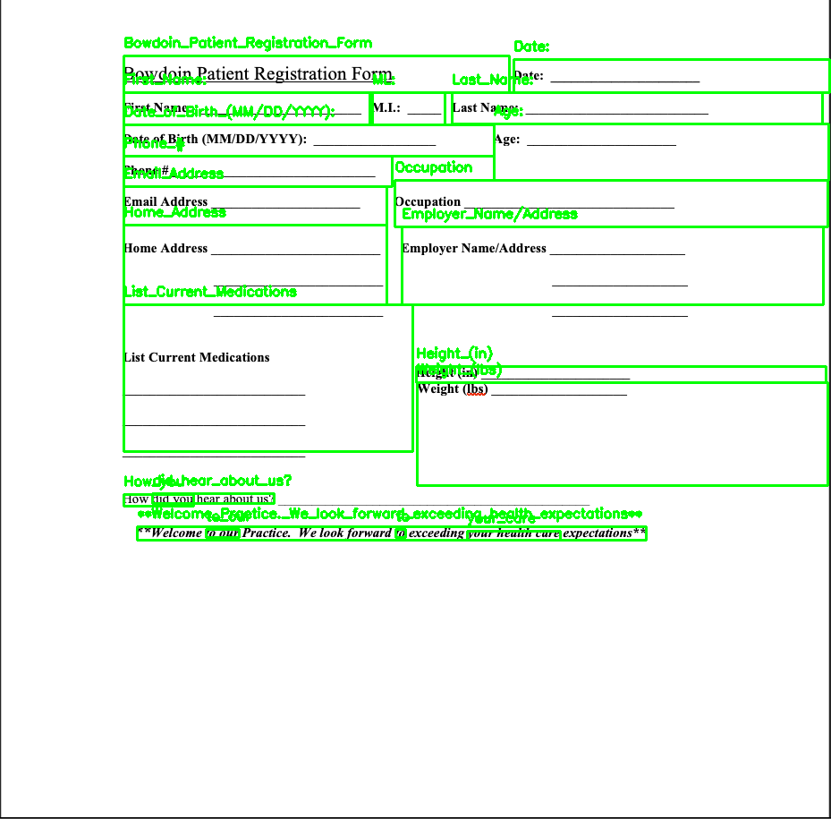
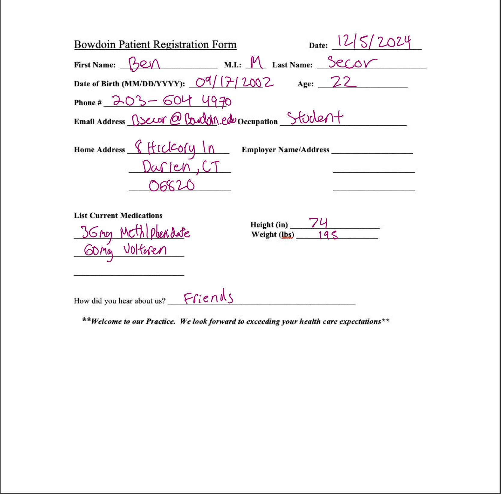
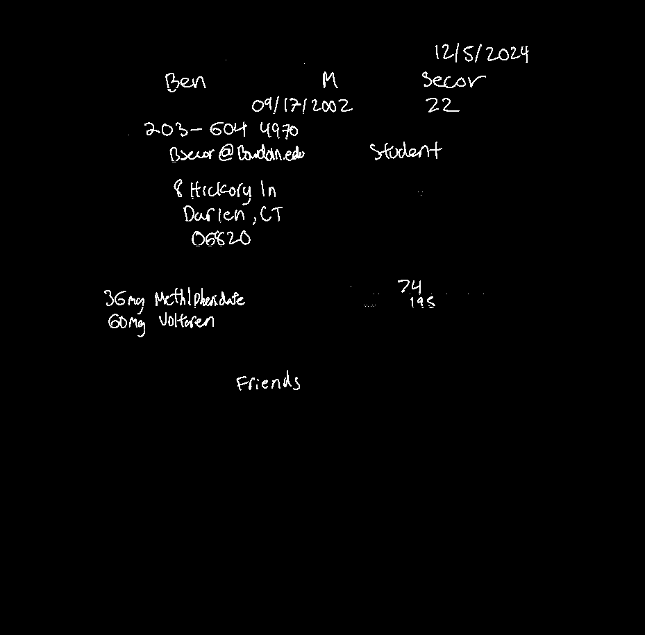
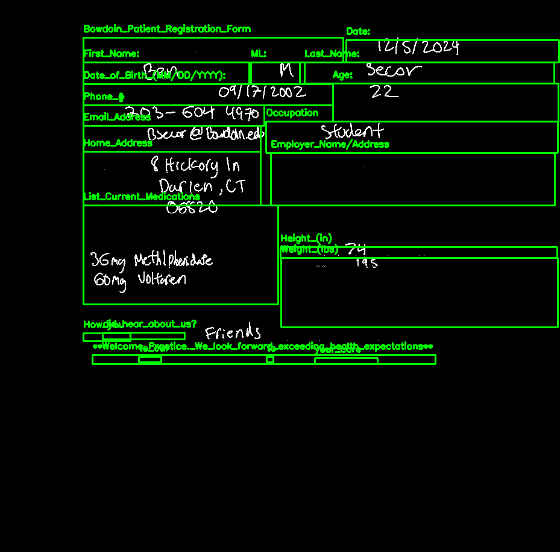

# HealthForm2SQL

A Flask-based web application that extracts, processes, and stores form data into a dynamically generated SQL database. The project supports multi-format file uploads (PDF, PNG, JPG), utilizes OCR for text extraction, and enables visualization of the extracted data.

## Table of Contents
1. [Overview](#overview)
2. [Features](#features)
3. [Technologies Used](#technologies-used)
4. [Installation](#installation)
5. [Usage](#usage)
6. [System Workflow](#system-workflow)
7. [Future Enhancements](#future-enhancements)

## Overview
HealthForm2SQL simplifies the process of extracting and analyzing data from health forms. Users can upload blank forms to define data fields and filled forms for automated data extraction. Extracted data is stored dynamically in an SQL database and displayed for review.

## Features
- **Dynamic Database Schema:** Automatically adapts the database structure to match form fields.
- **Multi-file Uploads:** Process multiple forms simultaneously (PDF, PNG, or JPG).
- **PDF Parsing:** Converts PDFs to images for text extraction.
- **OCR Integration:** Extracts text and bounding boxes from uploaded form images.
- **Data Visualization:** Displays extracted data in a tabular format for easy review.

## Technologies Used
### Backend
- Python (Flask)
- SQLAlchemy
- pytesseract (OCR)
- Google Vision API (OCR - Handwriting Detection)
- PyMuPDF (PDF-to-image conversion as an alternative to pdf2image)

### Frontend
- React.js
- CSS for styling
- Bootstrap for UI components

### Database
- SQLite (Dynamic schema generation and data storage)

## Installation
### Prerequisites
Ensure the following are installed:
- Python (=3.9)
- Node.js (>=14.x)
- pip (Python package manager)

### Steps to Set Up the Project
1. Clone the repository:
   ```bash
   git clone https://github.com/yourusername/HealthForm2SQL.git
   cd HealthForm2SQL
   ```

2. Set up the backend:
   ```bash
   cd backend
   python -m venv venv
   source venv/bin/activate  # On Windows use `venv\Scripts\activate`
   pip install -r requirements.txt
   ```

3. Install frontend dependencies:
   ```bash
   npm install
   ```

4. Run the front end and backend concurrently
   ```bash
   npm run dev
   ```
5. Access the application at `http://localhost:3000`.

## Usage
### Step 1: Upload Blank Form
- Upload a blank form to extract field names and generate the database schema.

### Step 2: Upload Filled Forms
- Upload filled forms (PDF, PNG, JPG) for automated data extraction.

### Step 3: View Extracted Data
- The extracted data will be displayed in a table for review.

## System Workflow
1. **Blank Form Upload**:


   - Extracts fields using OCR and saves bounding boxes.
   - Updates the database schema dynamically.
3. **Filled Form Upload**:



   - Extracts data based on the saved bounding boxes.
   - Saves the extracted data to the database.
5. **Visualization**:
   
   - Displays data in a user-friendly table.

## Future Enhancements
- Support for additional file formats (e.g., TIFF).
- Integration of advanced analytics and reporting tools.
- Add detection for mis aligned scans of forms
